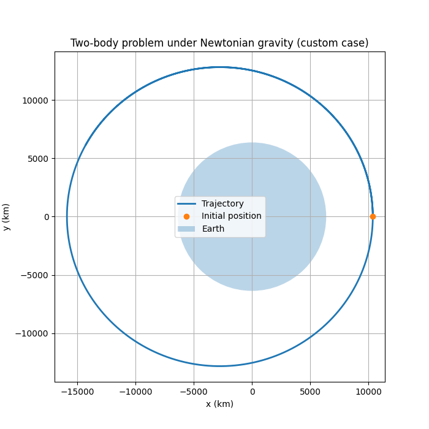
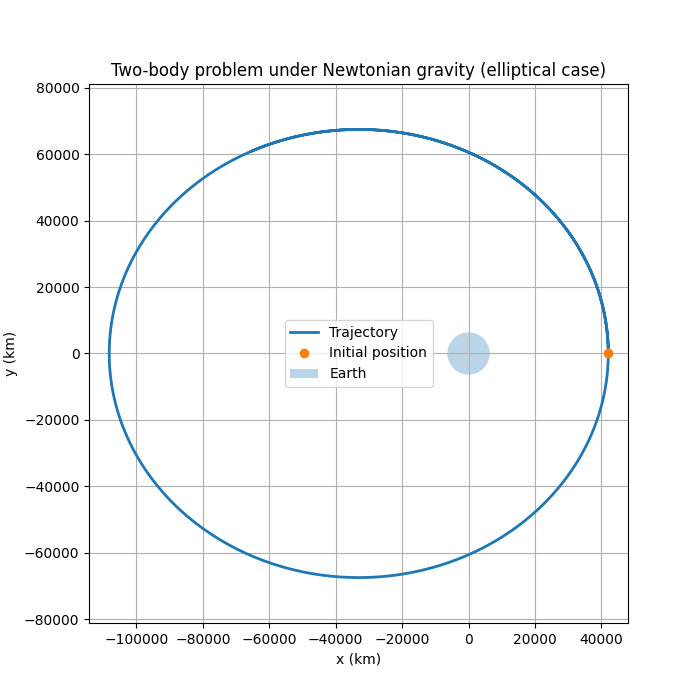
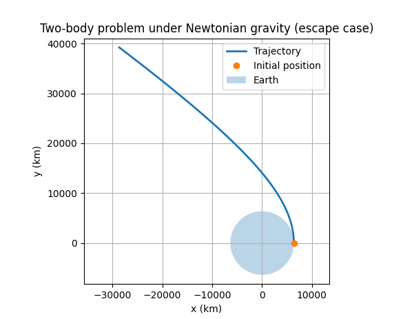
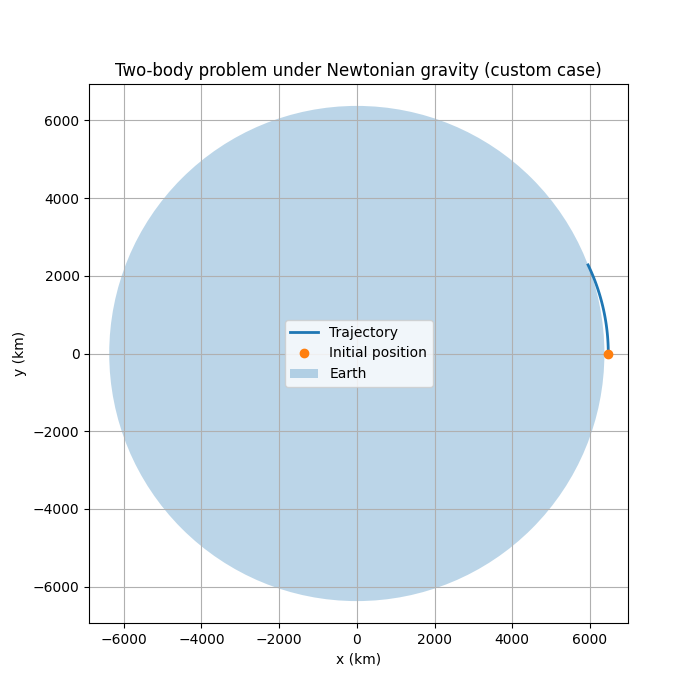

README.md
# Two-body problem (Newtonian gravity)

This Python script simulates the motion of a spacecraft in the gravitational field of Earth using Newton's law of gravitation and numerical integration.

It accompanies the book:

**Astrofísica – La física del origen, evolución y destino del Universo**
*(Astrophysics – The physics of the origin, evolution, and fate of the Universe)*

---

# 1. What this script does

The program numerically integrates the equations of motion of a body moving under the gravitational attraction of Earth.

It illustrates several fundamental orbital regimes:

- circular orbit
- elliptical orbit
- escape trajectory

The motion is computed using `scipy.integrate.solve_ivp`.

---

# 2. Requirements

You need Python 3 and the following packages:

numpy
scipy
matplotlib

Install them with:

pip install numpy scipy matplotlib

---

# 3. How to run the script

Simply run:

```python two_body.py```

A window will appear showing the computed trajectory.

---

# 4. Parameters you can modify

The most important parameters appear near the beginning of the script.

	### Orbit type
	orbit_type = "elliptical"

	Possible values:
	"circular"
	"elliptical"
	"escape"
	"custom"

	---

	### Initial altitude
	h = 400e3
	Altitude above Earth's surface (meters).

	Example: h = 1 starts exactly at one meter above Earth's surface. Note: h = 0 is not allowed.

	---

	### Custom velocity
	Used only if orbit_type = "custom", then custom_speed_factor = 0.9
	The velocity is defined as v = custom_speed_factor * v_circular
	Examples:
	| factor | result |
	|------|------|
	| 0.7 | impact trajectory |
	| 1.0 | circular orbit |
	| 1.2 | elliptical orbit |
	| 1.5 | escape trajectory |

---

# 5. Understanding the code

The spacecraft state vector is defined as [x, y, vx, vy] where
- `x,y` = position
- `vx,vy` = velocity

The system of differential equations is
	dx/dt = vx
	dy/dt = vy

whre dv/dt = gravitational acceleration. The gravitational acceleration is implemented as
	a = -mu * r / |r|^3
The equations are integrated using solve_ivp() which is a general-purpose numerical ODE solver.

---

# 6. The physical model

The script implements a simplified version of the **two-body problem**.

Assumptions:
- Earth is fixed at the origin
- the spacecraft mass is negligible
- gravity follows classic Newton's inverse-square law
- no atmosphere
- no thrust
- motion is planar

The gravitational parameter used is mu = GM where
- `G` = gravitational constant
- `M` = mass of Earth

For Earth: mu = 3.986004418 × 10^14 m³/s²
The spacecraft mass does not appear in the equations because it cancels out when combining
	F = G M m / r²
	F = m a

---

# 7. Orbital regimes

The type of orbit depends on the specific mechanical energy ε = v²/2 − μ/r as follows:

| Energy | Orbit type |
|------|------|
| ε < 0 | elliptical |
| ε = 0 | parabolic |
| ε > 0 | hyperbolic |

---

# 8. Experiments you can try

Try modifying the speed factor:

	custom_speed_factor = 0.7
	custom_speed_factor = 1.0
	custom_speed_factor = 1.3
	custom_speed_factor = 1.6

Observe how the trajectory changes. You can also try different altitudes, for example:

	h = 100e3
	h = 1000e3
	h = 10000e3

---

# 9. Example results

## Circular orbit



## Elliptical orbit



## Escape trajectory



## Custom trajectory



---

# 10. Relation to the book

This script corresponds to the chapter **Gravedad Newtoniana y Órbitas ** in the book **Astrofísica – La física del origen, evolución y destino del Universo**
The goal is to provide a minimal numerical laboratory to explore classical orbital mechanics.
