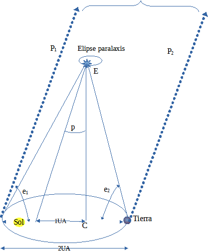

# Parallax estel·lar script

Corresponds to **Chapter 2 - Measuring Distances, 2.3.1 Geometric Direct Measurement by Parallax**.

This is the classic method known for a long time: the star is observed from two different positions on Earth in its orbit, separated by about 6 months, and the apparent displacement of the star relative to the background of much more distant stars (which practically don't move) is measured. From Earth, a nearby star appears to move relative to the distant background, tracing an apparent ellipse over a year: this is the parallax ellipse.

Simplified model:
  Sun at the center
  Earth in a circular orbit of 1 AU
  distant star at a distance d
  the apparent position seen from Earth is calculated over the course of the year

The result: the star traces a small apparent ellipse in the sky; the maximum angle is the parallax.
The simulation numerically reproduces the geometry illustrated in the book (Fig. 19). 



Geometry shown in the book:
  - The Earth moves around the Sun with radius 1 AU.
  - The star remains fixed in space.
  - The apparent direction of the star changes as the observer moves.
  - The small angular displacement measured in the simulation corresponds to the parallax angle 
    𝑝 p shown in the diagram.
  - The apparent path traced by the star on the sky is the parallax ellipse.

# 1. What this script does


---

# 2. Requirements

You need Python 3 and the following packages:

numpy
scipy
matplotlib

Install them with:

pip install numpy scipy matplotlib

---

# 3. How to run the script

Simply run:

```python two_body.py```

A window will appear showing the computed trajectory.

---

# 4. Parameters you can modify

The most important parameters appear near the beginning of the script.
