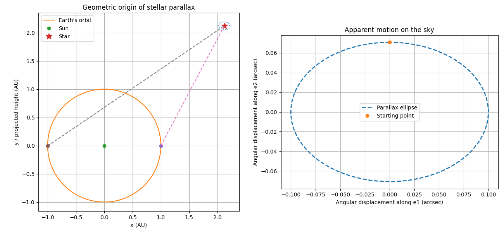

# Parallax estel·lar script

Corresponds to **Chapter 2 - Measuring Distances, 2.3.1 Geometric Direct Measurement by Parallax**.

This is the classic method known for a long time: the star is observed from two different positions on Earth in its orbit, separated by about 6 months, and the apparent displacement of the star relative to the background of much more distant stars (which practically don't move) is measured. From Earth, a nearby star appears to move relative to the distant background, tracing an apparent ellipse over a year: this is the parallax ellipse.

Geometry shown in the book:

  - The Earth moves around the Sun with radius 1 AU.
  - The star remains fixed in space.
  - The apparent direction of the star changes as the observer moves.
  - The small angular displacement measured in the simulation corresponds to the parallax angle 
    𝑝 p shown in the diagram.
  - The apparent path traced by the star on the sky is the parallax ellipse.

# 1. What this script does

Works with a simplified model:

  Sun at the center
  Earth in a circular orbit of 1 AU
  distant star at a distance d
  the apparent position seen from Earth is calculated over the course of the year

The result: the star traces a small apparent ellipse in the sky; the maximum angle is the parallax.
The simulation numerically reproduces the geometry illustrated in the book (Fig. 19). 


---

# 2. Requirements

You need Python 3 and the following packages:

numpy
os
matplotlib

Install them with:

```pip install numpy os matplotlib```

---

# 3. How to run the script

Simply run:

```python 02_stellar_parallax.py```

A window will appear showing the computed parallax.

---

# 4. Parameters you can modify

The most important parameters appear near the beginning of the script.
I recommend these three:

→ almost straight line
  ```distance_pc = 10.0``` 
  ```beta_deg = 0.0```

→ clear ellipse
  ```distance_pc = 10.0```
  ```beta_deg = 45.0```

→ circle
  ```distance_pc = 10.0```
  ```beta_deg = 90.0```

# 5. Examples

The left panel is not to scale, the star is shown much closer than in reality so that the geometry can be visualized.; but it serves very well to visualize the Sun, the Earth's orbit, the star, two lines of sight separated by half a year. The right panel shows the observational physical result: the small parallax ellipse.

Distance to the star (pc): 10.0

Ecliptic latitude beta (deg): 45.0

Theoretical parallax (arcsec): 0.1

Horizontal semi-axis (arcsec): 0.09999950444832925

Vertical semi-axis (arcsec): 0.07070997743968281



